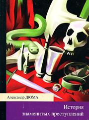

Известный французский писатель, автор популярного исторического романа "Граф Монте-Кристо".

  
[Иоанна Неаполитанская](Иоанна%20Неаполитанская.md)

  
[Карл Людвиг Занд](Карл%20Людвиг%20Занд.md)

  
[Мюрат](Мюрат.md)

.jpg)  
[Семейство Борджа (сборник)](Семейство%20Борджа%20(сборник).md)

  
[Семейство Ченчи](Семейство%20Ченчи.md)
