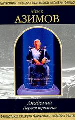

Американский писатель-фантаст *20* века. Автор около *500* книг. Обладатель множества литературных наград. 

  
[Автора! Автора!](Автора!%20Автора!.md)

.jpg)  
[Академия и Земля (сборник)](Академия%20и%20Земля%20(сборник).md)

  
[Академия и Земля](Академия%20и%20Земля.md)

  
[Академия и Империя](Академия%20и%20Империя.md)

  
[Академия на краю гибели. Академия и Земля](Академия%20на%20краю%20гибели.%20Академия%20и%20Земля.md)

  
[Академия на краю гибели](Академия%20на%20краю%20гибели.md)

  
[Академия. Академия и Империя. Вторая Академия](Академия.%20Академия%20и%20Империя.%20Вторая%20Академия.md)

  
[Академия. Классическая трилогия](Академия.%20Классическая%20трилогия.md)

  
[Академия](Академия.md)

  
[Александр Бог](Александр%20Бог.md)

  
[Американская фантастика. Том 7](Американская%20фантастика.%20Том%207.md)

  
[Аппарат Холмса-Гинкнишка](Аппарат%20Холмса-Гинкнишка.md)

  
[Баттон, Баттон](Баттон,%20Баттон.md)

  
[Безобразный Малыш](Безобразный%20Малыш.md)

  
[Бессмертный бард](Бессмертный%20бард.md)

  
[Бильярдный шар](Бильярдный%20шар.md)

  
[Глазам дано не только видеть](Глазам%20дано%20не%20только%20видеть.md)

  
[Конец Вечности. Сами боги](Конец%20Вечности.%20Сами%20боги.md)

  
[Край Академии](Край%20Академии.md)

  
[Миры Айзека Азимова. Книга 1](Миры%20Айзека%20Азимова.%20Книга%201.md)

  
[Миры Айзека Азимова. Книга 2](Миры%20Айзека%20Азимова.%20Книга%202.md)

  
[Миры Айзека Азимова. Книга 4](Миры%20Айзека%20Азимова.%20Книга%204.md)

  
[Миры Айзека Азимова. Книга 5](Миры%20Айзека%20Азимова.%20Книга%205.md)

  
[Миры Айзека Азимова. Книга 6](Миры%20Айзека%20Азимова.%20Книга%206.md)

  
[Миры Айзека Азимова](Миры%20Айзека%20Азимова.md)

  
[Мой сын - физик](Мой%20сын%20-%20физик.md)

  
[Немезида](Немезида.md)

  
[Роботы и Империя](Роботы%20и%20Империя.md)

  
[Человек, создавший XXI век](Человек,%20создавший%20XXI%20век.md)

  
[Что это за штука - любовь](Что%20это%20за%20штука%20-%20любовь.md)

  
[Что, если...](Что,%20если....md)

  
[Чтобы мы не помнили](Чтобы%20мы%20не%20помнили.md)

  
[Чувство силы](Чувство%20силы.md)

  
[Шах Пепе С.](Шах%20Пепе%20С..md)

  
[Штрейкбрехер](Штрейкбрехер.md)

  
[Я буду ни при чём](Я%20буду%20ни%20при%20чём.md)
