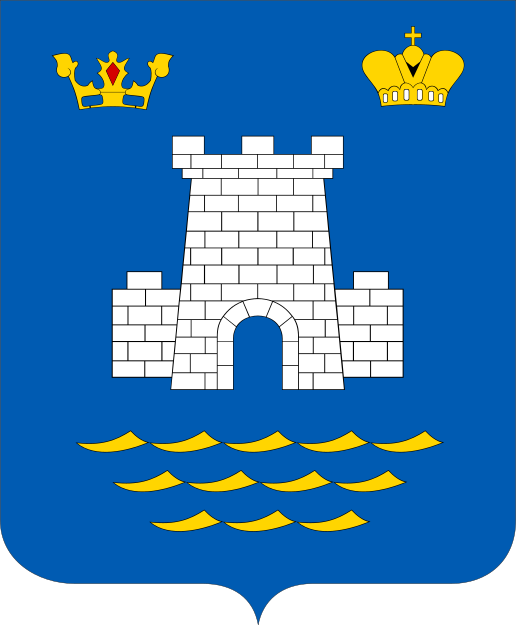

<!--2022-08-05 00:51:12-->

## Алушта
Город на южном побережье Крыма. 
В городе расположено множество санаториев, заповедник. 

Население &emsp; ***31,000*** &emsp; 
Год&nbsp;основания &emsp; ***6 век***