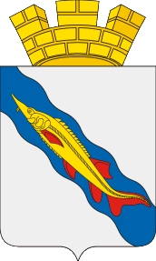

<!--2023-02-19 00:20:12-->
### Ейск
Курортный город на юго-западе России на берегу Азовского моря.
В городе и окрестностях расположено множество санаториев, баз отдыха, отелей, грязевой курорт.
Имеется большая обустроенная набережная с пляжами.

 
Население &emsp; ***83,000*** &emsp; 
Год&nbsp;основания &emsp; ***1848***