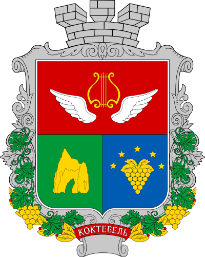

<!--2023-02-12 00:53:44-->
### Коктебель
Курортный посёлок городского типа на юго-востоке *Крыма*. 
Рядом с городом на хребте *Узун Сырт* расположен центр планеризма.

 
Население &emsp; ***3,300*** &emsp; 
Год&nbsp;основания &emsp; ***19 век***