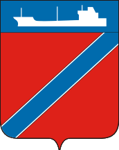

<!--2023-04-02 18:05:05-->
### Туапсе
Портовый промышленный город на черноморском побережье. 
Город не является курортом и является промежуточным пунктом для туристов,
следующих в курортные места *Туапсинского* района - *Небуг*, *Агой*, *Ольгинка*, *Шепси*.

 
Население &emsp; ***61,500*** &emsp; 
Год&nbsp;основания &emsp; ***1838***