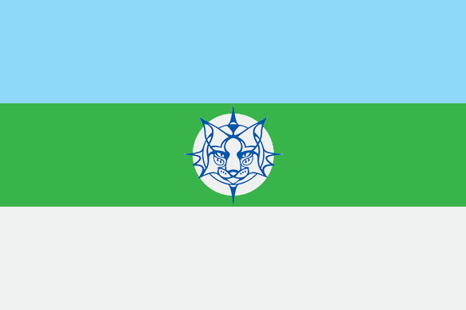

<!--2024-01-01 11:44:25-->
## Шерегеш
Посёлок в *Кемеровской* области (Кузбасс) у подножия горы *Зелёная* и одноимённый горнолыжный курорт.
Известен своим горнолыжным курортом и рудниками железной руды.
Сам посёлок небольшой - *3* улицы с хрущевками и многоэтажками.
Зато у подножия горы *Зелёная* расположены около *50* гостиниц разного типа для гостей курорта.

 
Население &emsp; ***10,000*** &emsp; 
Год&nbsp;основания &emsp; ***1914***