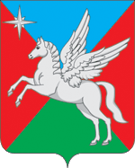

<!--2024-02-06 01:26:55-->

## Васильевское
Сельское поселение Васильевское - муниципальное образование Серпуховского района.
Площадь поселения - *110,5* кв.км.

Население &emsp; ***3,650*** &emsp; 
Год&nbsp;основания &emsp; ***1917***