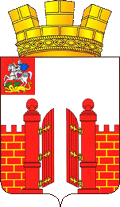

<!--2023-03-15 20:11:03-->
## Верея
Город в *100* км от Москвы в Наро-Фоминском округе.
Самый маленький город Московской области.
В Верее сохранились старые храмы и остатки Кремля.

 
Население &emsp; ***5,000*** &emsp; 
Год&nbsp;основания &emsp; ***1371***