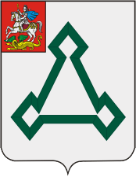

<!--2021-10-23 01:33:04-->
### Волоколамск
Город расположен в *100* км к северо-западу от Москвы. 
В черте города протекает река Лама и ее притоки.
Город основан в *11* веке и имеет историческое значение.

 
Население &emsp; ***18,500*** &emsp; 
Год&nbsp;основания &emsp; ***1135***