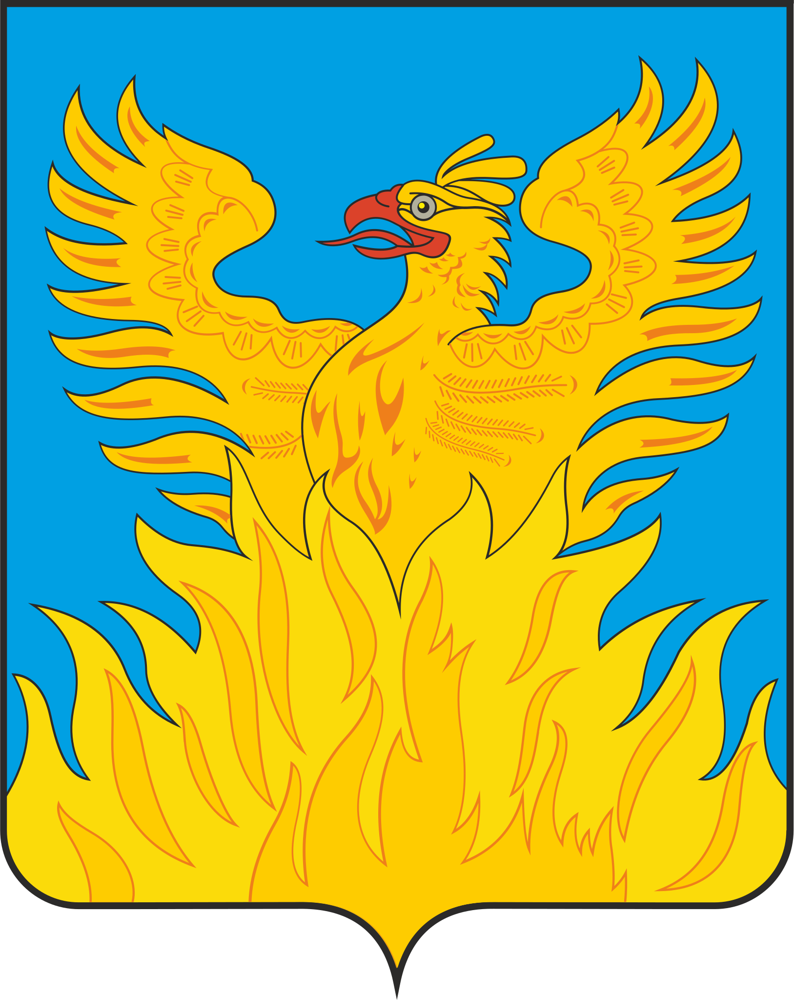

<!--2021-10-17 15:23:26-->

## Воскресенск
Город в *80* км к юго-востоку от Москвы. Расположен по обеим берегам Москва-реки.
Известен благодаря заводу удобрений и хоккейному клубу при нем.

Население &emsp; ***92,000*** &emsp; 
Год&nbsp;основания &emsp; ***1862***