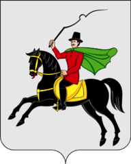

<!--2022-01-07 00:44:22-->
## Клин
Город на берегу реки Сестры в *67* км к северо-западу от Москвы. 
В городе расположено множество достопримечательностей и памятников древнего зодчества, 
в нём находится мясокомбинат, производитель знаменитых *Клинских* колбас.

 
Население &emsp; ***79,500*** &emsp; 
Год&nbsp;основания &emsp; ***1317***