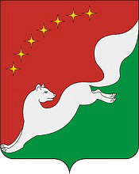

<!--2022-07-18 01:01:11-->

## Краснозаводск
Город в Сергиево-Посадском районе Московской области.
В городе расположен *Краснозаводский химический завод (КХЗ)*, который производит
патроны, фейерверки и сигнальные шашки.

Население &emsp; ***12,550*** &emsp; 
Год&nbsp;основания &emsp; ***1915***