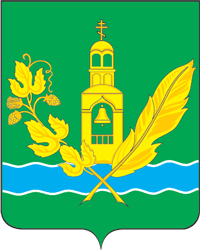

<!--2021-11-20 14:30:06-->
### Куровское
Город в *90* км к юго-востоку от Москвы. 
В нем расположены *Гуслицкий Спасо-Преображенский монастырь*, узловая железнодорожная станция.

 
Население &emsp; ***21,000*** &emsp; 
Год&nbsp;основания &emsp; ***1646***