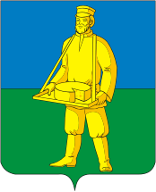

<!--2022-07-26 00:58:24-->

## Лотошино
Рабочий посёлок в *27* км к северо-западу от пгт Шаховская.
Стоит на реке Лобь, притоке реки Шоша.
В посёлке есть молочный, овощесушильный, спирто-водочный заводы.

Население &emsp; ***4,800*** &emsp; 
Год&nbsp;основания &emsp; ***1478***