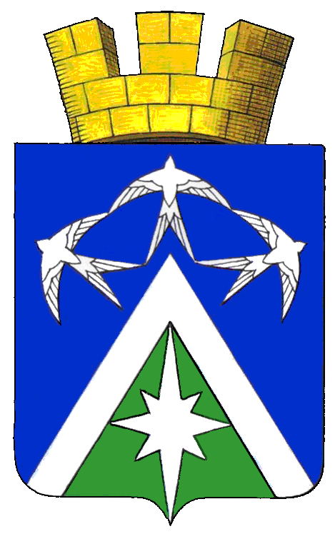

<!--2021-10-27 23:39:39-->

## Луховицы
Город в *135* км к юго-востоку от Москвы.
Знаменит огурцами, выращиваемыми в Луховицком районе и авиационным заводом "*Миг*".

Население &emsp; ***30,500*** &emsp; 
Год&nbsp;основания &emsp; ***1594***