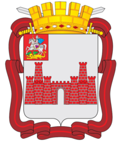

<!--2023-06-10 23:29:01-->

## Можайск
Город в *95* км к западу от Москвы.
В городе располагается знаменитый *Можайский молочный завод*.
Сохранились средневековые *Можайский кремль*, *Лужецкий монастырь*.

Население &emsp; ***33,500*** &emsp; 
Год&nbsp;основания &emsp; ***1231***