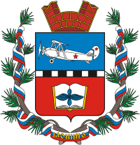

<!--2021-11-02 01:29:12-->
## Монино
Посёлок городского типа в Щёлковском городском округе в *20* км к востоку от Москвы.
Ранее в посёлке располагалась Военно-воздушная академия им. Гагарина, 
ныне школа-интернат с начальной лётной подготовкой.

 
Население &emsp; ***20,500*** &emsp; 
Год&nbsp;основания &emsp; ***1792***