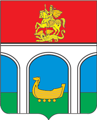

<!--2021-10-19 00:40:04-->
## Мытищи
Город расположен к северо-востоку от Москвы на границе с МКАД, на берегу реки Яуза.
В городе много памятников и объектов культурного наследия, например, первый в Росии водопровод,
открытый в начале *19* века и частично функционирующий до сих пор.

 
Население &emsp; ***245,000*** &emsp; 
Год&nbsp;основания &emsp; ***1460***