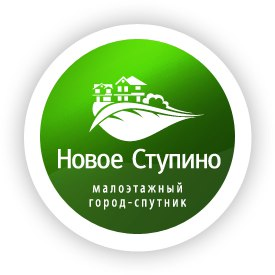

<!--2023-12-09 00:52:55-->
## Новое Ступино
Малоэтажный строщийся с *2010* года город-спутник, включающий доступное жильё, 
индустриальный парк с рабочими местами, торговую и деловую инфраструктуру, лесную природу.
Находится в *78* км от МКАД и *20* км от города *Ступино*.

 
Население &emsp; ***8,000*** &emsp; 
Год&nbsp;основания &emsp; ***2010***