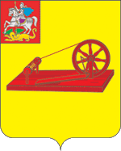

<!--2021-10-21 00:49:04-->

## Ногинск
Город на реке Клязьме в *35* км к востоку от Москвы.
В прошлом был крупным центром российской текстильной промышленности.
На территории Ногинского района расположено несколько военных городков.

Население &emsp; ***103,000*** &emsp; 
Год&nbsp;основания &emsp; ***1389***