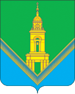

<!--2022-01-18 00:44:01-->

## Павловский Посад
Город на реке Клязьме при слиянии с рекой Вохной в *65* км к востоку от Москвы.
В городе работает текстильное производство знаменитых *павлово-посадских платков*, 
расположено много старых купеческих домов и храмов.

Население &emsp; ***63,000*** &emsp; 
Год&nbsp;основания &emsp; ***1328***