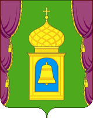

<!--2025-03-10 01:12:44-->
### Пушкино
Город в Московской области в *17* км от МКАД по Ярославскому шоссе.
В летнее время в *1920*-*1928* годах в городе жил советский поэт *Владимир Маяковский*.

 
Население &emsp; ***111,500*** &emsp; 
Год&nbsp;основания &emsp; ***16 век***