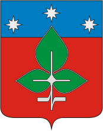

<!--2021-12-01 00:38:04-->

## Пущино
Город-наукоград на берегу Оки в *80* км к югу от Москвы.
В нём находятся *Пущинский биологический научный центр* РАН, большой радиотелескоп.

Население &emsp; ***21,000*** &emsp; 
Год&nbsp;основания &emsp; ***1956***