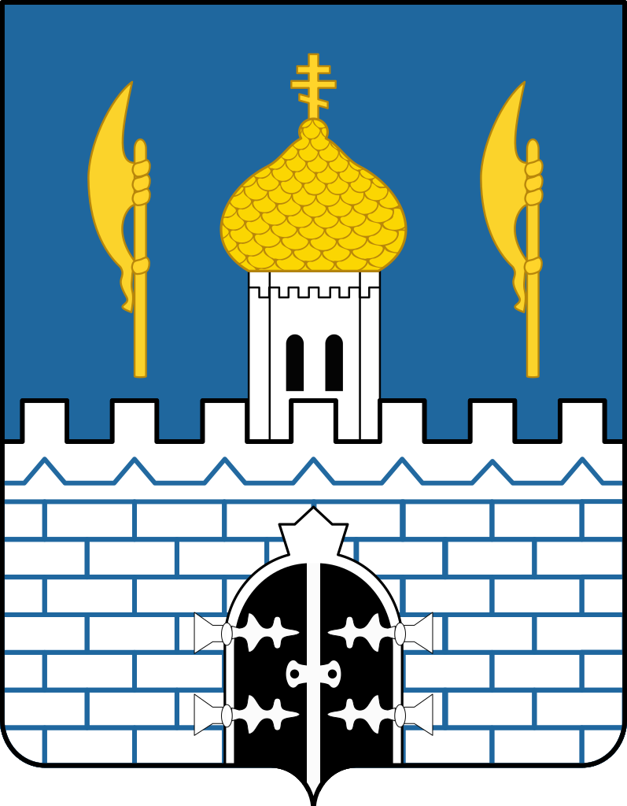

<!--2021-10-26 00:22:02-->
 
## Сергиев Посад
Город в *52* км к северо-востоку от Москвы.
В нем расположен знаменитый мужской монастырь *Троице-Сергиева лавра*. 
Входит в туристический маршрут по древним городам "*Золотое кольцо России*".

Население &emsp; ***100,000*** &emsp; 
Год&nbsp;основания &emsp; ***1337***