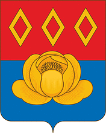

<!--2021-10-25 00:17:11-->
### Старая Купавна
Город на реке Купавинка в *22* км к востоку от Москвы.
В городе располагается крупное российское фармацевтическое производство.

 
Население &emsp; ***24,000*** &emsp; 
Год&nbsp;основания &emsp; ***1353***