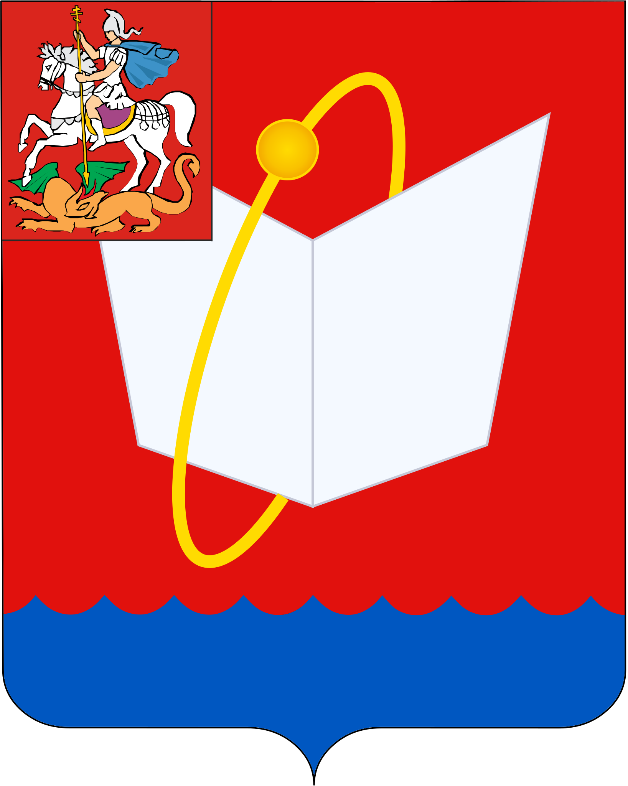

<!--2021-11-04 00:55:07-->

## Фрязино
Город-наукоград в *20* км к северо-востоку на берегу реки Любосеевка.
Российский центр СВЧ-электроники.

Население &emsp; ***60,000*** &emsp; 
Год&nbsp;основания &emsp; ***1584***