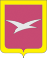

<!--2021-11-05 13:29:03-->

## Чехов
Город в *55* км к югу от столицы на реке Лопасня, притоке Оки.
Образовался из древнего села Лопасня, в середине *20* века переименованного в Чехов.
Из Чехова родом известный советский журналист Юрий Бычков, 
автор туристического маршрута "*Золотое кольцо России*".

Население &emsp; ***71,000*** &emsp; 
Год&nbsp;основания &emsp; ***1175***