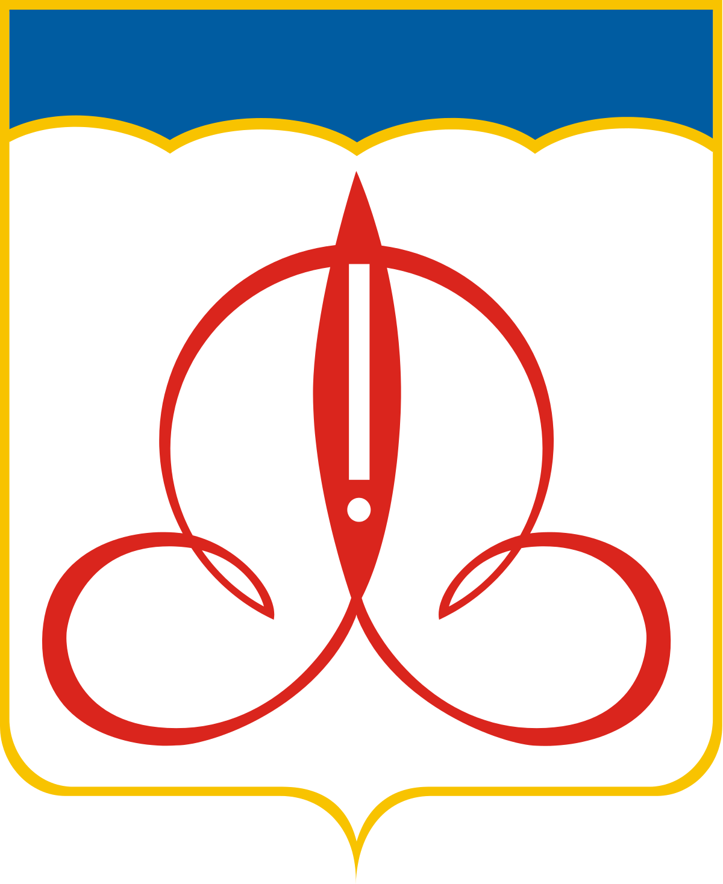

<!--2023-02-23 01:40:39-->
### Щёлково
Город в *15* км к северо-западу от Москвы на берегу реки Клязьмы.
В городе расположен знаменитый *БКК "Щёлковохлеб"*.
На юго-восточной окраине города находится большой военный аэродром *Чкаловский*.

 
Население &emsp; ***135,000*** &emsp; 
Год&nbsp;основания &emsp; ***1925***