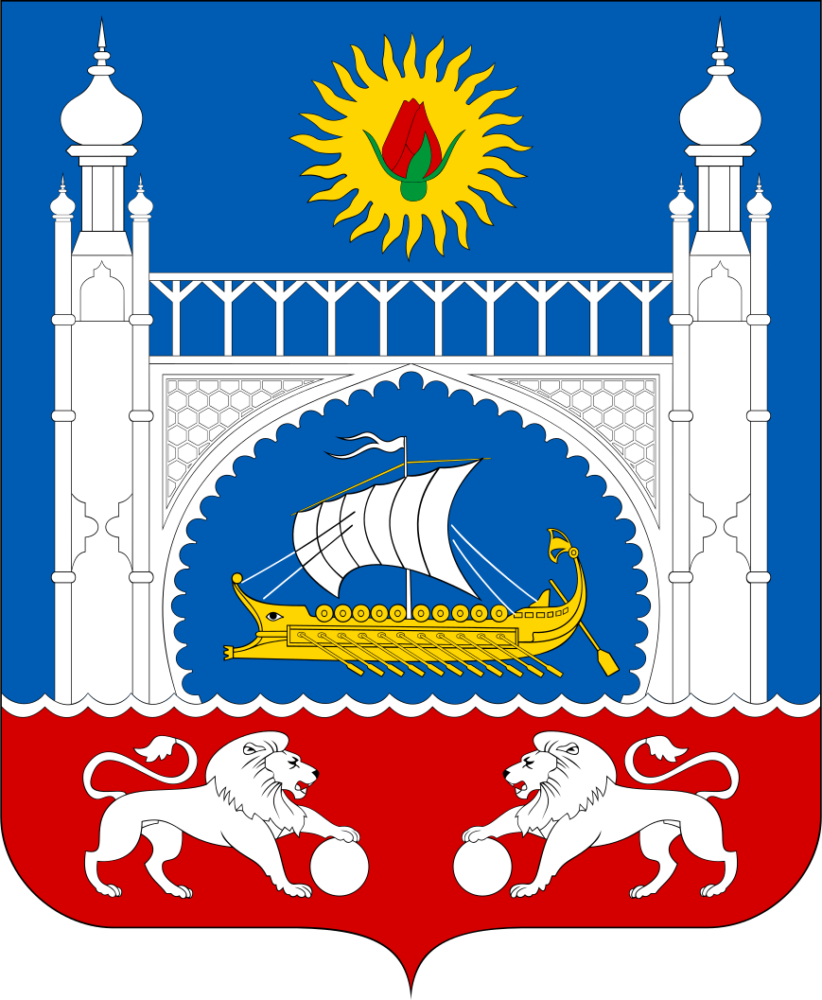
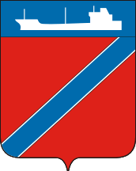
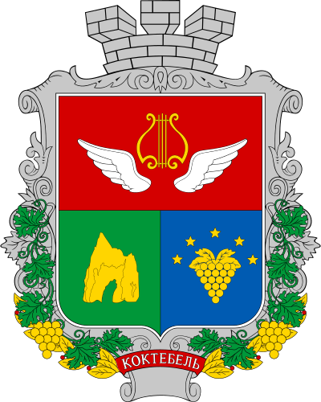
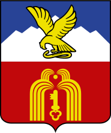
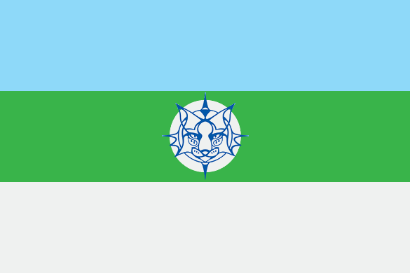
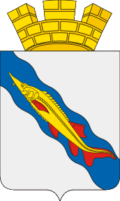
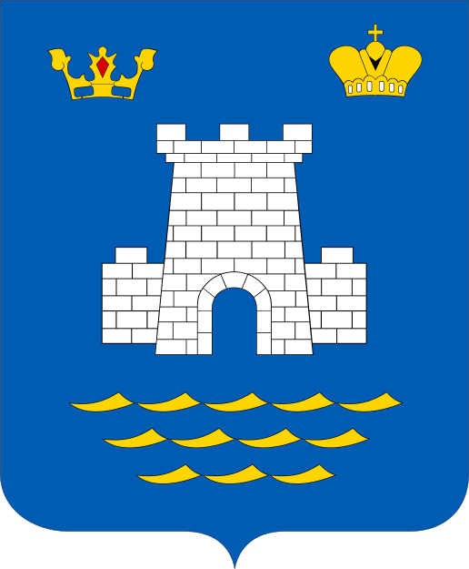

<!----><!--2022-08-05 01:05:07-->

## Алупка
Город на южном побережье Крыма. 
В городе расположены цеха выдержки вин производственного объединения "*Массандра*",
санаторий *Министерства обороны России*.

Население &emsp; ***8,000*** &emsp; 
Год&nbsp;основания &emsp; ***960***<!--n:Алупка:s:0:e:510-->
<!----><!--2023-04-02 18:05:05-->

## Туапсе
Портовый промышленный город на черноморском побережье. 
Город не является курортом и является промежуточным пунктом для туристов,
следующих в курортные места *Туапсинского* района - *Небуг*, *Агой*, *Ольгинка*, *Шепси*.

Население &emsp; ***61,500*** &emsp; 
Год&nbsp;основания &emsp; ***1838***<!--n:Туапсе:s:542:e:619-->
<!----><!--2023-02-12 00:53:44-->

## Коктебель
Курортный посёлок городского типа на юго-востоке *Крыма*. 
Рядом с городом на хребте *Узун Сырт* расположен центр планеризма.

Население &emsp; ***3,300*** &emsp; 
Год&nbsp;основания &emsp; ***19 век***<!--n:Коктебель:s:1195:e:468-->
<!----><!--2022-08-03 00:20:02-->

## Пятигорск
Город на юге России, минеральный и грязевой курорт. 
Туристический центр района *Кавказских Минеральных Вод*.

Население &emsp; ***145,000*** &emsp; 
Год&nbsp;основания &emsp; ***1780***<!--n:Пятигорск:s:1704:e:435-->
<!----><!--2024-01-01 11:44:25-->

## Шерегеш
Посёлок в *Кемеровской* области (Кузбасс) у подножия горы *Зелёная* и одноимённый горнолыжный курорт.
Известен своим горнолыжным курортом и рудниками железной руды.
Сам посёлок небольшой - *3* улицы с хрущевками и многоэтажками.
Зато у подножия горы *Зелёная* расположены около *50* гостиниц разного типа для гостей курорта.

Население &emsp; ***10,000*** &emsp; 
Год&nbsp;основания &emsp; ***1914***<!--n:Шерегеш:s:2180:e:814-->
<!----><!--2023-02-19 00:20:12-->

## Ейск
Курортный город на юго-западе России на берегу Азовского моря.
В городе и окрестностях расположено множество санаториев, баз отдыха, отелей, грязевой курорт.
Имеется большая обустроенная набережная с пляжами.

Население &emsp; ***83,000*** &emsp; 
Год&nbsp;основания &emsp; ***1848***<!--n:Ейск:s:3031:e:603-->
<!----><!--2022-08-05 00:51:12-->

## Алушта
Город на южном побережье Крыма. 
В городе расположено множество санаториев, заповедник. 

Население &emsp; ***31,000*** &emsp; 
Год&nbsp;основания &emsp; ***6 век***<!--n:Алушта:s:3665:e:391-->
<!----><!--2025-09-20 22:21:30-->Интересные места отдыха в России.<!--n:about:s:4091:e:94-->
