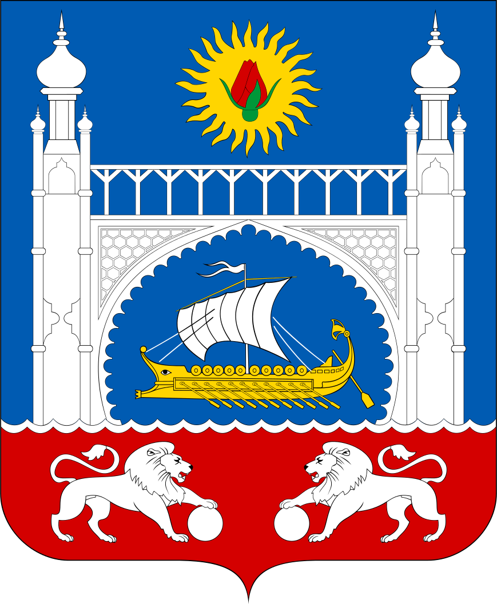

<!--2022-08-05 01:05:07-->

## Алупка
Город на южном побережье Крыма. 
В городе расположены цеха выдержки вин производственного объединения "*Массандра*",
санаторий *Министерства обороны России*.

Население &emsp; ***8,000*** &emsp; 
Год&nbsp;основания &emsp; ***960***