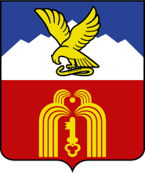

<!--2022-08-03 00:20:02-->

## Пятигорск
Город на юге России, минеральный и грязевой курорт. 
Туристический центр района *Кавказских Минеральных Вод*.

Население &emsp; ***145,000*** &emsp; 
Год&nbsp;основания &emsp; ***1780***