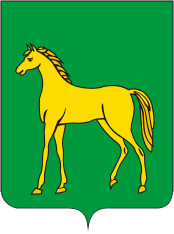

<!--2021-10-27 00:46:01-->

## Бронницы
Живописный город в *52* км к юго-востоку от столицы в пойме Москва-реки.
Сохранились постройки *17* века большого конного завода, работавшего в городе в прошлые века.

Население &emsp; ***22,500*** &emsp; 
Год&nbsp;основания &emsp; ***1453***