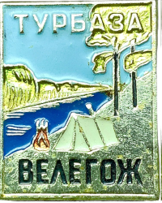

<!--2023-03-30 00:03:06-->

## Велегож
Село и расположенный рядом одноимённый туристический посёлок у реки Ока в *120* км к югу от Москвы.
В окрестностях села на реке Ока снималось несколько эпизодов советского фильма *"Верные друзья"*.

Население &emsp; ***130***+***311*** &emsp; 
Год&nbsp;основания &emsp; ***17 век***