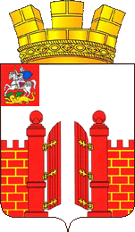

<!--2023-03-15 20:11:03-->

## Верея
Город в *100* км от Москвы в Наро-Фоминском округе, в *22* км к югу от ж/д станции Можайск.
Самый маленький город Московской области площадью *5* кв.км. 
В Верее сохранились старые храмы и остатки Кремля.

Население &emsp; ***4,900*** &emsp; 
Год&nbsp;основания &emsp; ***1371***