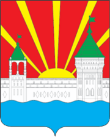

<!--2025-09-20 12:03:03-->

## Дзержинский

Город, примыкающий к МКАД на юго-востоке Москвы, на берегу реки Москва.
В нем находится старинный Николо-Угрешский монастырь, основанный Дмитрием Донским в *1380* году в честь победы в Куликовской битве. Площадь города - *15,66* кв.км.

Население &emsp; ***57,000*** &emsp; 
Год&nbsp;основания &emsp; ***1380***  
