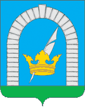

<!--2022-07-25 01:11:12-->

## Ерино
Посёлок в Рязановском поселении НАО.
Расположен в *18* км от МКАД по старому Варшавскому шоссе рядом с местом слияния рек Десна и Пахра.
В посёлке расположены действующие легкоатлетический стадион и санаторий работников атомной промышленности.

Население &emsp; ***3,000*** &emsp; 
Год&nbsp;основания &emsp; ***1650***