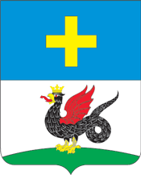

<!--2021-11-01 00:45:33-->

## Кашира
Город на берегу реки Оки в *90* км к югу от Москвы.
В городе до сих пор сохранилась жилая одно- двухэтажная застройка эпохи классицизма *19* века.
В *2015* году в состав Каширы вошел город Ожерелье.

Население &emsp; ***48,000*** &emsp; 
Год&nbsp;основания &emsp; ***1356***