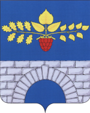

<!--2022-07-19 00:56:04-->

## Малино
Посёлок городского типа в Ступинском городском округе в *88* км к юго-востоку от Москвы.
В посёлке действует производство керамики, выращивают картофель.

Население &emsp; ***3,600*** &emsp; 
Год&nbsp;основания &emsp; ***1353***