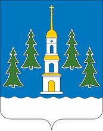

<!--2021-10-22 01:03:04-->

## Раменское
Город расположен в *30* км к юго-востоку от Москвы.
В черте города находится Борисоглебское озеро, названное по стоящей рядом старинной церкви *17* века.

Население &emsp; ***123,500*** &emsp; 
Год&nbsp;основания &emsp; ***1628***