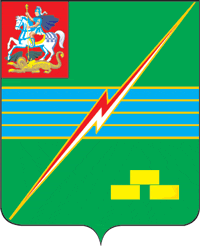

<!--2021-10-24 00:32:32-->

## Электрогорск
Город в *75* км к востоку от Москвы.
В городе расположена одна из первых электростанций России, работавшая на торфе (ныне на газе) - <i>ГРЭС-3 им.Класона</i>.

Население &emsp; ***22,500*** &emsp; 
Год&nbsp;основания &emsp; ***1912***