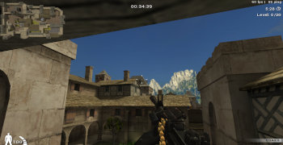
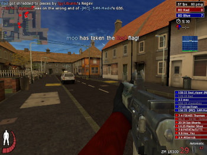
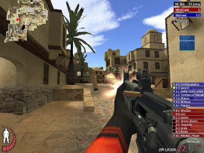

<!----><!--2023-12-27 00:47:12-->
## Игра в 'Urban Terror 4' 
Играю один в режим *GUNGAME* на карте *Kingdom*.

<i>Сайт игры <a href="https://www.urbanterror.info">urbanterror.info</a></i>

<!--n:Игра Urt 4:s:0:e:294-->
<!----><!--2023-12-18 23:29:03-->
## Игра в 'Urban Terror 4' 
***Urban Terror 4*** старый, но популярный онлайн-шутер на движке *Quake 3*. 
Играл с племянником в выходные в режиме *GUNGAME*.

<i>Сайт игры <a href="https://www.urbanterror.info">urbanterror.info</a></i>

<!--n:Игра Urt 4 вдвоем:s:328:e:455-->
<!----><!--2025-09-20 22:21:30-->Заметки про игру в онлайн-шутер ***Urban Terror***<!--n:about:s:832:e:109-->
<!----><!--2023-12-27 00:51:11-->
## Игра в 'Urban Terror 5' 
***Urban Terror 5. Resurgence*** находящаяся в разработке новая версия онлайн-шутера на движке *Unreal Tourtament 5*.
Графика будет лучше. Надеюсь, дождёмся...

<i>Источник фан-сайт игры <a href="https://urbanterror.fandom.com">urbanterror.fandom.com</a></i>

<!--n:Новый Urt 5:s:968:e:523-->
