<!----><!--2021-03-27 19:27:11-->
## Новая версия 'Contra'
Попробовал **Contra Evolution HD** - ремейк для ПК легендарной игры **Contra** с приставок 90-х с теми же уровнями и музыкой, но более красочной графикой и звуком.
Сложно, но есть возможность переключения уровней по *Ctrl+F5*.

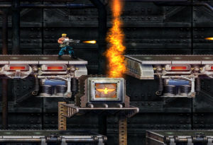<!--n:Новая версия Contra:s:0:e:480-->
<!----><!--2021-11-15 01:03:03-->
## Игры в аркадном эмуляторе MAME
*MAME* - эмулятор аркадных автоматов 80-х и 90-х годов.
Отличный повод поиграть в любимые игры вдвоём на джойстиках.

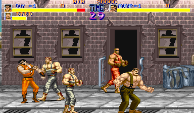
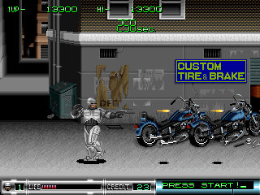
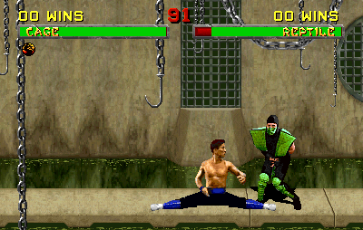<!--n:Аркадный эмулятор MAME:s:530:e:466-->
<!----><!--2023-11-06 21:05:43-->
## Прохождение 'Streets Of Rage 4'
На праздниках играли с племянницей в новую версию аркадных драк *Streets Of Rage 4*. 
Играли на джойстиках в полноценную современную версию под *Linux*,
не на эмуляторе *mednafen*, как в предыдущие версии это игры.
В игре великолепная рисованная графика, есть прохождение и поединки ***1*** *на* ***1***, 
как в *Mortal Kombat*. 
Прошли пока несколько уровней *Улицы* -> *Полицейский участок* -> *Корабль* -> *Порт* -> *Подвал/Бар*.

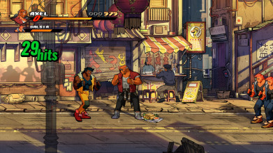
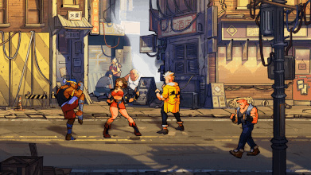<!--n:Прохождение Streets Of Rage 4:s:1056:e:938-->
<!----><!--2022-05-30 00:29:01-->
[Wine](https://www.winehq.org/) - мощный эмулятор для запуска программ *Windows* (в основном игр) в среде *Linux*.<!--n:Эмулятор Wine:s:2057:e:198-->
<!----><!--2024-03-09 10:51:13-->
## Игра в '8-bit Commando'
Скачал с сайта [freelinuxpcgames.com](//freelinuxpcgames.com/8-bit-commando) очередную игру для *Linux*,
чтобы поиграть на джойстиках с племянниками. Платформер, похожий на легендарную *Contra*.
Графика как на *Dendy*, но играть довольно интересно, правда, сложно.

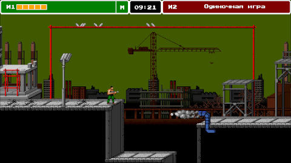<!--n:8-bit Commando:s:2299:e:542-->
<!----><!--2021-03-08 21:02:05-->
## Любимые игры на 'Mednafen'

<td>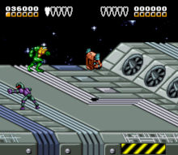
<td>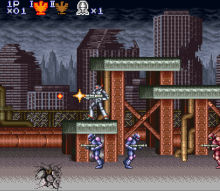
<td>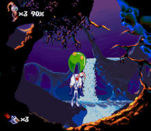

Продолжаю исследовать любимые игры детства на игровых приставках в эмуляторе [Mednafen](https://mednafen.github.io)

* Battletoads
* Contra 3
* Earth Worm Jim 2<!--n:Любимые игры на Mednafen:s:2878:e:497-->
<!----><!--2021-11-15 01:50:02-->
## Игры в аркадном эмуляторе MAME
Продолжаю осваивать аркадные хиты в эмуляторе *MAME*.

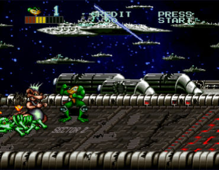
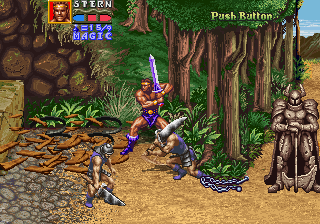
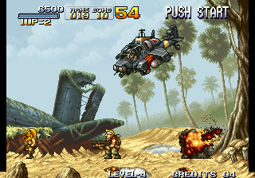<!--n:Игры на MAME:s:3435:e:366-->
<!----><!--2021-10-25 00:11:01-->
## Конфиг 'mednafen' для SNES
Строчки изменений конфига *mednafen.cfg* для игр в хорошем качестве во весь экран в разрешении экрана ПК

    ;Использовать указанный метод масштабирования видео.
    snes.special 2xsai

    ;Растянуть на весь экран
    snes.stretch aspect

    ;Полноэкранное разрешение по горизонтали.
    snes.xres 0 ; взять с Рабочего стола

    ;Полноэкранное разрешение по вертикали.
    snes.yres 0 ; взять с Рабочего стола

Запуск игры
   
    mednafen "c:\Mortal Kombat.zip"

Клавиши после запуска

    Alt+Enter Переход в полный экран
    F1        Меню настроек<!--n:Конфиг mednafen для SNES:s:3842:e:937-->
<!----><!--2025-09-20 22:21:30-->Заметки и впечатления от игр для ретро-консолей *90*-х 
(*Dendy*, *Sega*, *SNES*) на эмуляторах для ПК.<!--n:about:s:4835:e:194-->
<!----><!--2021-03-14 14:20:10-->
## Уличные драки 'Final Fight'
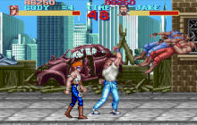
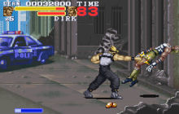
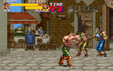

Легендарная серия игр про уличные драки ***Final Fight 1,2,3*** в эмуляторе [Mednafen](https://mednafen.github.io).
Популярной игра стала на игровых автоматах в начале 90-х и затем вышла на игровых приставках.<!--n:Игры-драки на Mednafen:s:5057:e:586-->
<!----><!--2023-11-30 22:51:09-->
## Игра в 'Sudden Strike 4'
*Sudden Strike 4* отличная игра для любителей тактических стратегий.<!--n:Игра Sudden Strike 4:s:5699:e:179-->
<!----><!--2021-03-08 15:46:00-->

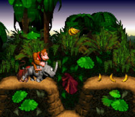
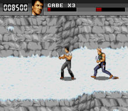
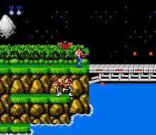

[Mednafen](https://mednafen.github.io) качественный эмулятор популярных консолей 90-х 
*Dendy*, *Sega*, *Super Nintendo* и др.

Запуск игры (рома) из консоли после установки в Linux:
    
    mednafen ~/Загрузки/roms/Contra.nes<!--n:Эмулятор консолей Mednafen:s:5925:e:489-->
<!----><!--2022-11-06 15:59:01-->
## Прохождение 'Streets Of Rage'
<td>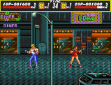
<td>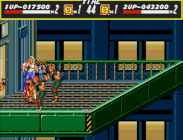
<td>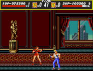

Прошли вдвоём с племянницей до 8-го уровня в драках ***Bare Knuckle*** *(Streets of Rage)* от *Sega*
в эмуляторе *Mednafen* на ПК. Дальше пока не получилось - сложно, хотя играли на сложности *Easy* с сейвами.
Интересная игра для двоих, похожая на ***Final Fight***.<!--n:Прохождение Streets Of Rage:s:6479:e:664-->
