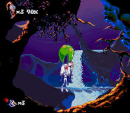
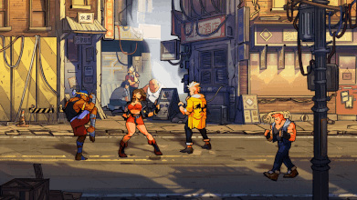
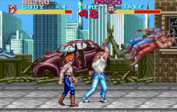

Заметки и впечатления от игр для ретро-консолей *90*-х 
(*Dendy*, *Sega*, *SNES*) на эмуляторах для ПК.

* [8-bit Commando](8-bit%20Commando.md)
  
[8-bit-commando](8-bit-commando.jpg)

  
[Bare-Knuckle_0](Bare-Knuckle_0.jpg)

  
[Bare-Knuckle_1](Bare-Knuckle_1.jpg)

  
[Bare-Knuckle_2](Bare-Knuckle_2.jpg)

  
[Battletoads-SNES](Battletoads-SNES.jpg)

  
[Cliffhanger-SNES](Cliffhanger-SNES.jpg)

  
[Contra-Evolution-HD](Contra-Evolution-HD.jpg)

  
[Contra-NES](Contra-NES.jpg)

  
[Contra3-SNES](Contra3-SNES.jpg)

  
[DK-SNES](DK-SNES.jpg)

  
[Jim2-SNES](Jim2-SNES.jpg)

* [MK2-MAME](MK2-MAME.png)
* [Robocop2-MAME](Robocop2-MAME.png)
  
[Streets-Of-Rage-4_1](Streets-Of-Rage-4_1.jpg)

  
[Streets-Of-Rage-4_2](Streets-Of-Rage-4_2.jpg)

  
[btoads-MAME](btoads-MAME.jpg)

  
[ff-SNES](ff-SNES.jpg)

  
[ff2-SNES](ff2-SNES.jpg)

  
[ff3-SNES](ff3-SNES.jpg)

* [ffight-MAME](ffight-MAME.png)
* [ga2-MAME](ga2-MAME.png)
* [mslug-MAME](mslug-MAME.png)
* [Аркадный эмулятор MAME](Аркадный%20эмулятор%20MAME.md)
* [Игра Sudden Strike 4](Игра%20Sudden%20Strike%204.md)
* [Игры на MAME](Игры%20на%20MAME.md)
* [Игры-драки на Mednafen](Игры-драки%20на%20Mednafen.md)
* [Конфиг mednafen для SNES](Конфиг%20mednafen%20для%20SNES.md)
* [Любимые игры на Mednafen](Любимые%20игры%20на%20Mednafen.md)
* [Новая версия Contra](Новая%20версия%20Contra.md)
* [Прохождение Streets Of Rage 4](Прохождение%20Streets%20Of%20Rage%204.md)
* [Прохождение Streets Of Rage](Прохождение%20Streets%20Of%20Rage.md)
* [Эмулятор Wine](Эмулятор%20Wine.md)
* [Эмулятор консолей Mednafen](Эмулятор%20консолей%20Mednafen.md)