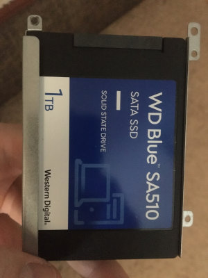

<!--2023-01-22 00:12:44-->
### Замена HDD на SSD на ноутбуке
На днях заменил в своем ноутбуке *Lenovo Z50-70* жесткий диск *Seagate HDD 1Тб* на *WD SSD 1Тб*.
Он существенно легче по весу, но особой прибавки скорости загрузки ОС и приложений не заметил.
Родной *Seagate* был не хуже. Но поскольку данные на него перенес, он легче по весу и меньше потребляет энергии,
оставлю в его системе. 

