Здесь собраны цитаты мудрейших людей мира. Политиков, философов, писателей, актеров.

  
[a_mostovoy](a_mostovoy.jpg)

  
[a_suvorov](a_suvorov.jpg)

  
[albert_enshtein](albert_enshtein.jpg)

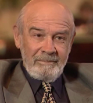  
[antibiotik](antibiotik.jpg)

  
[arnold_schwarz](arnold_schwarz.jpg)

  
[b_show](b_show.jpg)

* [belmondo](belmondo.jpeg)
  
[bill_clinton](bill_clinton.jpg)

  
[bruce_lee](bruce_lee.jpg)

  
[cherchesov](cherchesov.jpg)

  
[cherchill](cherchill.jpg)

  
[chinmoy](chinmoy.jpg)

  
[d_assang](d_assang.jpg)

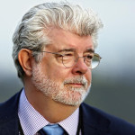  
[dj_lukas](dj_lukas.jpg)

  
[franklin](franklin.jpg)

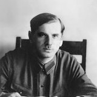  
[frenkel](frenkel.jpg)

  
[gandi](gandi.jpg)

  
[gendalf](gendalf.jpg)

  
[ilon_mask](ilon_mask.jpg)

  
[john_galsworthy](john_galsworthy.jpg)

  
[jon_silver](jon_silver.jpg)

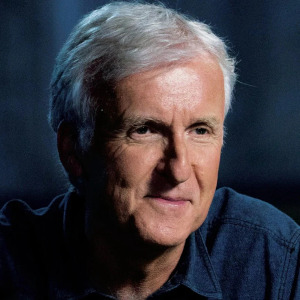  
[js_cameron](js_cameron.jpg)

  
[kasparov](kasparov.jpg)

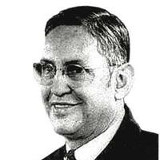  
[kastaneda](kastaneda.jpg)

  
[klod_le_rua](klod_le_rua.jpg)

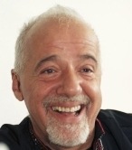  
[koelo](koelo.jpg)

  
[konfuciy](konfuciy.jpg)

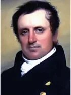  
[kuper](kuper.jpg)

  
[kuril-x-files](kuril-x-files.jpg)

  
[lao_tsi](lao_tsi.jpg)

  
[larry_wall](larry_wall.jpg)

  
[lev_yashin](lev_yashin.jpg)

  
[lincoln](lincoln.jpg)

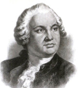  
[lomonosov](lomonosov.jpg)

  
[luzhkov](luzhkov.jpg)

  
[mann](mann.jpg)

  
[mark_twen](mark_twen.jpg)

  
[mayakovskii](mayakovskii.jpg)

  
[moem](moem.jpg)

* [mosmetro](mosmetro.svg)
  
[napoleon](napoleon.jpg)

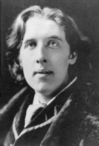  
[oskar_wild](oskar_wild.jpg)

  
[paust](paust.jpg)

  
[petr_1](petr_1.jpg)

  
[putin](putin.jpg)

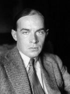  
[remark](remark.jpg)

  
[roosvelt](roosvelt.jpg)

  
[sergey_dovlatov](sergey_dovlatov.jpg)

  
[shekspir](shekspir.jpg)

  
[sklyar](sklyar.jpg)

  
[solomon](solomon.jpg)

  
[stalin](stalin.jpg)

  
[stallone](stallone.jpg)

  
[tall](tall.jpg)

  
[tarkovskiy](tarkovskiy.jpg)

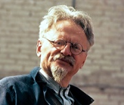  
[trotskiy](trotskiy.jpg)

  
[turgenev](turgenev.jpg)

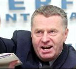  
[zhirik](zhirik.jpg)

* [Авраам Линкольн, американский президент](Авраам%20Линкольн,%20американский%20президент.md)
* [Александр Мостовой, футболист](Александр%20Мостовой,%20футболист.md)
* [Александр Суворов, русский полководец](Александр%20Суворов,%20русский%20полководец.md)
* [Альберт Эйнштейн, выдающийся немецкий физик-теоретик](Альберт%20Эйнштейн,%20выдающийся%20немецкий%20физик-теоретик.md)
* [Андрей Тарковский, советский режиссер](Андрей%20Тарковский,%20советский%20режиссер.md)
* [Антибиотик, главарь банды из сериала Бандитский Петербург](Антибиотик,%20главарь%20банды%20из%20сериала%20Бандитский%20Петербург.md)
* [Арнольд Шварценеггер, американский бодибилдер и актер](Арнольд%20Шварценеггер,%20американский%20бодибилдер%20и%20актер.md)
* [Бенджамин Франклин, американский политический деятель](Бенджамин%20Франклин,%20американский%20политический%20деятель.md)
* [Билл Клинтон, американский президент](Билл%20Клинтон,%20американский%20президент.md)
* [Брюс Ли, мастер боевых искусств, актер](Брюс%20Ли,%20мастер%20боевых%20искусств,%20актер.md)
* [Владимир Жириновский, российский политик и депутат](Владимир%20Жириновский,%20российский%20политик%20и%20депутат.md)
* [Владимир Маяковский, советский поэт](Владимир%20Маяковский,%20советский%20поэт.md)
* [Владимир Путин, российский президент](Владимир%20Путин,%20российский%20президент.md)
* [Гарри Каспаров, шахматист](Гарри%20Каспаров,%20шахматист.md)
* [Генрих Манн, немецкий писатель](Генрих%20Манн,%20немецкий%20писатель.md)
* [Гэндальф, маг из Властелина Колец](Гэндальф,%20маг%20из%20Властелина%20Колец.md)
* [Джеймс Кэмерон, американский кинорежиссёр](Джеймс%20Кэмерон,%20американский%20кинорежиссёр.md)
* [Джеймс Фенимор Купер, американский писатель](Джеймс%20Фенимор%20Купер,%20американский%20писатель.md)
* [Джон Голсуорси, английский писатель](Джон%20Голсуорси,%20английский%20писатель.md)
* [Джон Сильвер, пират из романа Остров Сокровищ](Джон%20Сильвер,%20пират%20из%20романа%20Остров%20Сокровищ.md)
* [Джордж Бернард Шоу, выдающийся ирландский драматург, лауреат Нобелевской прем](Джордж%20Бернард%20Шоу,%20выдающийся%20ирландский%20драматург,%20лауреат%20Нобелевской%20прем.md)
* [Джордж Лукас, американский кинорежиссер](Джордж%20Лукас,%20американский%20кинорежиссер.md)
* [Джулиан Ассанж, основатель сайта WikiLeaks](Джулиан%20Ассанж,%20основатель%20сайта%20WikiLeaks.md)
* [Жан-Поль Бельмондо, французский актер](Жан-Поль%20Бельмондо,%20французский%20актер.md)
* [Игорь Скляр, российский актер театра и кино](Игорь%20Скляр,%20российский%20актер%20театра%20и%20кино.md)
* [Илон Маск, американский изобретатель и миллиардер](Илон%20Маск,%20американский%20изобретатель%20и%20миллиардер.md)
* [Иосиф Сталин, глава советсткого государства](Иосиф%20Сталин,%20глава%20советсткого%20государства.md)
* [Карлос Кастанеда, американский писатель-эзотерик](Карлос%20Кастанеда,%20американский%20писатель-эзотерик.md)
* [Клод ле Руа, французский футбольный тренер](Клод%20ле%20Руа,%20французский%20футбольный%20тренер.md)
* [Константин Паустовский, русский писатель](Константин%20Паустовский,%20русский%20писатель.md)
* [Конфуций, китайский философ](Конфуций,%20китайский%20философ.md)
* [Курильщик из сериала Секретные Материалы](Курильщик%20из%20сериала%20Секретные%20Материалы.md)
* [Лао-Цзы, китайский философ](Лао-Цзы,%20китайский%20философ.md)
* [Ларри Уолл, американский программист](Ларри%20Уолл,%20американский%20программист.md)
* [Лев Троцкий, советский революционер](Лев%20Троцкий,%20советский%20революционер.md)
* [Лев Яшин, советский футбольный вратарь](Лев%20Яшин,%20советский%20футбольный%20вратарь.md)
* [Марк Твен, американский писатель](Марк%20Твен,%20американский%20писатель.md)
* [Махатма Ганди, индийский политический деятель](Махатма%20Ганди,%20индийский%20политический%20деятель.md)
* [Михаил Ломоносов, русский ученый](Михаил%20Ломоносов,%20русский%20ученый.md)
* [Наполеон, французский император](Наполеон,%20французский%20император.md)
* [Нафталий Френкель, один из руководителей ГУЛАГа](Нафталий%20Френкель,%20один%20из%20руководителей%20ГУЛАГа.md)
* [Оскар Уайлд, британский писатель](Оскар%20Уайлд,%20британский%20писатель.md)
* [Пауло Коэльо, бразильский писатель](Пауло%20Коэльо,%20бразильский%20писатель.md)
* [Петр I, русский император](Петр%20I,%20русский%20император.md)
* [Сергей Довлатов, советский писатель](Сергей%20Довлатов,%20советский%20писатель.md)
* [Сильвестр Сталлоне, американский актер и режиссер](Сильвестр%20Сталлоне,%20американский%20актер%20и%20режиссер.md)
* [Станислав Черчесов, российский футболист и тренер](Станислав%20Черчесов,%20российский%20футболист%20и%20тренер.md)
* [Теодор Рузвельт, американский политический деятель](Теодор%20Рузвельт,%20американский%20политический%20деятель.md)
* [Тургенев Иван, писатель](Тургенев%20Иван,%20писатель.md)
* [Уильям Сомерсет Моэм, британский писатель](Уильям%20Сомерсет%20Моэм,%20британский%20писатель.md)
* [Уильям Шекспир, средневековый английский поэт и драматург](Уильям%20Шекспир,%20средневековый%20английский%20поэт%20и%20драматург.md)
* [Уинстон Черчилль, английский политический деятель](Уинстон%20Черчилль,%20английский%20политический%20деятель.md)
* [Царь Соломон, ветхозаветный правитель](Царь%20Соломон,%20ветхозаветный%20правитель.md)
* [Шарль Морис де Талейран-Перигор, министр иностранных дел времен Наполеона](Шарль%20Морис%20де%20Талейран-Перигор,%20министр%20иностранных%20дел%20времен%20Наполеона.md)
* [Шри Чинмой, индуистский проповедник](Шри%20Чинмой,%20индуистский%20проповедник.md)
* [Эрих Мария Ремарк, немецкий писатель](Эрих%20Мария%20Ремарк,%20немецкий%20писатель.md)
* [Юрий Лужков, мэр г.Москвы](Юрий%20Лужков,%20мэр%20г.Москвы.md)