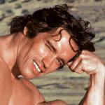

<!--2023-09-30 23:31:14-->
## Арнольд Шварценеггер, американский бодибилдер и актер

    Людям всегда нужен кто-то, кто будет присматривать за ними. 
    95 процентов людей в мире нуждаются, чтобы кто-то говорил им, 
    что делать и как себя вести.

>  

    Победа не дает силу. Силу дает борьба. 
    Если ты борешься и не сдаешься — это и есть сила.

>  

    Член — это не мускул. Его не накачаешь, как плечи или грудь. 
    Ты не сделаешь его больше, упражняясь с ним. Поверьте мне, это точно.

>  

    Поражение — это не вариант. Каждый должен идти к успеху.

>  
    
    Жить — это значит постоянно оставаться голодным. Смысл жизни состоит не в том, 
    чтобы просто существовать и выживать, а в том, чтобы двигаться 
    вперед, вверх, достигать и завоевывать.

>  

    Чужих денег не надо, у меня хватает своих, и все решения я принимаю 
    только во благо людей.
