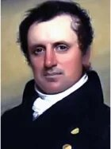

<!--2017-01-07 19:35:21-->
## Джеймс Фенимор Купер, американский писатель

    Много есть людей с красивой внешностью, которым, однако, 
    нечем похвастаться внутри.

>  

    Самая редкая вещь, какую только можно найти на земле - 
    это по-настоящему справедливый человек.

>  

    Осмотрительность так же подобает воину, как и храбрость.

>  

    Книги, подобно оружию, обладают силой, 
    чтобы спасти или разрушить.

>  

    Улыбка, появляющаяся на лице без всякого повода, или 
    не в меру медоточивые речи - вернейшие доказательства 
    лицемерия.

>  

    Безделье - не отдых.

>  

    Плох тот советник, который сам не слушает чужих советов.

>  

    Когда белый умирает, он думает, что для него наступила 
    минута покоя, но краснокожие умеют мучить даже 
    призраки своих врагов.