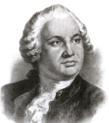

<!--2021-11-29 15:08:04-->
### Михаил Ломоносов, русский ученый

    Кто малого не может, тому и большее невозможно.

>  

    В общении все дни проходят наши, 
    но искусство общаться — удел немногих...

>  

    Один опыт я ставлю выше, чем тысячу мнений,
    рожденных только воображением.

>  

    Ошибки замечать немногого стоит: дать нечто лучшее — 
    вот что приличествует достойному человеку.

>  

    Математику уже за то любить следует, 
    что она ум в порядок приводит.
