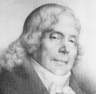

<!--2020-01-22 22:24:32-->
### Шарль Морис де Талейран-Перигор, министр иностранных дел времен Наполеона

    Для того чтобы иметь много денег, не надо иметь много ума,
    а надо не иметь совести.

>  

    Верить в судьбу, значит не верить в себя.

>  

    Политика — это всего лишь способ возбуждать 
    народ таким образом, чтобы суметь его использовать.